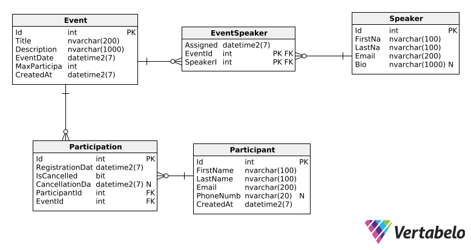

Aplikacja będzie dostępna na: `http://localhost:1337`

#### Poprawne utworzenie wydarzenia
```bash
# tworzymy uzytkownikow potrzebnych do kolejnych testow (juz jacys są ale na potrzebe tych testow tworzymy nowych)
curl -X POST "http://localhost:1337/api/speakers" \
  -H "Content-Type: application/json" \
  -d '{
    "firstName": "Marta",
    "lastName": "Wiśniewska",
    "email": "marta.wisniewska@pjwstk.edu.pl",
    "bio": "Specjalista ds. cloud computing"
  }'

# sprawdzamy czy speaker zostal utworzony
curl -X GET "http://localhost:1337/api/speakers/3"

curl -X POST "http://localhost:1337/api/participants" \
  -H "Content-Type: application/json" \
  -d '{
    "firstName": "Tomasz",
    "lastName": "Kowal",
    "email": "tomasz.kowal@pjwstk.edu.pl",
    "phoneNumber": "+48555123456"
  }'

# sprawdzamy czy participant zostal utworzony
curl -X GET "http://localhost:1337/api/participants/3"

curl -X POST "http://localhost:1337/api/events" \
  -H "Content-Type: application/json" \
  -d '{
    "title": "Konferencja .NET 2025",
    "description": "Coroczna konferencja .NET",
    "eventDate": "2025-07-15T09:00:00",
    "maxParticipants": 5
  }'

# sprawdzamy czy event zostal utworzony
curl -X GET "http://localhost:1337/api/events/3"
```
Oczekiwany rezultat: Status 201 Created, zwrócone dane wydarzenia 

#### Próbujemy stworzyć wydarzenie z przeszłą datą
```bash
curl -X POST "http://localhost:1337/api/events" \
  -H "Content-Type: application/json" \
  -d '{
    "title": "Wydarzenie przeszłe",
    "description": "Test walidacji daty",
    "eventDate": "2025-06-01T09:00:00",
    "maxParticipants": 10
  }'
```
Oczekiwany rezultat: Status 400 Bad Request, komunikat błędu walidacji // Event date cannot be in the past%

---

### Przypisanie prelegenta do wydarzenia

#### Przypisanie jednego prelegenta
```bash
curl -X POST "http://localhost:1337/api/events/3/speakers/3"

# sprawdzamy czy speaker zostal przypisany
curl -X GET "http://localhost:1337/api/events/3"
```
Oczekiwany rezultat: Status 200 OK

#### Przypisanie drugiego prelegenta do tego samego wydarzenia
```bash
# Dodanie drugiego prelegenta
curl -X POST "http://localhost:1337/api/speakers" \
  -H "Content-Type: application/json" \
  -d '{
    "firstName": "Paweł",
    "lastName": "Dąbrowski",
    "email": "pawel.dabrowski@pjwstk.edu.pl",
    "bio": "Specjalista ds. DevOps"
  }'

# sprawdzamy czy speaker zostal utworzony
curl -X GET "http://localhost:1337/api/speakers/4"

# przypisujemy go
curl -X POST "http://localhost:1337/api/events/3/speakers/4"

# sprawdzamy czy drugi speaker zostal przypisany
curl -X GET "http://localhost:1337/api/events/3"
```
Oczekiwany rezultat: Status 200 OK (wielokrotne przypisanie dozwolone)

#### Konflikt czasowy - prelegent w dwóch wydarzeniach jednocześnie
```bash
# tworzymy w tym samym czasie wydarzenie
curl -X POST "http://localhost:1337/api/events" \
  -H "Content-Type: application/json" \
  -d '{
    "title": "Konfliktujące wydarzenie",
    "description": "Test konfliktu czasowego",
    "eventDate": "2025-07-15T09:00:00",
    "maxParticipants": 3
  }'

# sprawdzamy czy drugie event zostal utworzony
curl -X GET "http://localhost:1337/api/events/4"

# probujemy przpisac tego samego speakera w tym samym czasie
curl -X POST "http://localhost:1337/api/events/4/speakers/3"
```
Oczekiwany rezultat: Status 400 Bad Request, komunikat o konflikcie czasowym // Speaker is already assigned to another event at the same time%

---

### Rejestracja uczestnika na wydarzenie

#### Poprawna rejestracja uczestnika
```bash
curl -X POST "http://localhost:1337/api/events/3/participants/3"

# sprawdzamy czy participant zostal zarejestrowany
curl -X GET "http://localhost:1337/api/events/3"
```
Oczekiwany rezultat: Status 200 OK

#### Próba ponownej rejestracji tego samego uczestnika
```bash
curl -X POST "http://localhost:1337/api/events/3/participants/3"
```
Oczekiwany rezultat: Status 400 Bad Request, komunikat o już istniejącej rejestracji // Participant is already registered for this event%

#### Rejestracja do wypełnionej pojemności
```bash
# dodajemy uczestnika
curl -X POST "http://localhost:1337/api/participants" \
  -H "Content-Type: application/json" \
  -d '{
    "firstName": "Agnieszka",
    "lastName": "Lewandowska",
    "email": "agnieszka.lewandowska@pjwstk.edu.pl",
    "phoneNumber": "+48555987654"
  }'

# sprawdzamy czy participant zostal utworzony
curl -X GET "http://localhost:1337/api/participants/4"

# wypełnienie wydarzenia do maksymalnej pojemności
curl -X POST "http://localhost:1337/api/events/3/participants/4"

# sprawdzamy stan wydarzenia
curl -X GET "http://localhost:1337/api/events/3"

# dodajemy do maksymalnej ilosci uzytkownikow
curl -v -X POST "http://localhost:1337/api/participants" \
  -H "Content-Type: application/json" \
  -d '{
    "firstName": "Uczestnik5",
    "lastName": "Test5",
    "email": "uczestnik5@pjwstk.edu.pl",
    "phoneNumber": "+48555000005"
  }'

curl -v -X POST "http://localhost:1337/api/events/3/participants/5"

curl -v -X POST "http://localhost:1337/api/participants" \
  -H "Content-Type: application/json" \
  -d '{
    "firstName": "Uczestnik6",
    "lastName": "Test6",
    "email": "uczestnik6@pjwstk.edu.pl",
    "phoneNumber": "+48555000006"
  }'

curl -v -X POST "http://localhost:1337/api/events/3/participants/6"

curl -v -X POST "http://localhost:1337/api/participants" \
  -H "Content-Type: application/json" \
  -d '{
    "firstName": "Uczestnik7",
    "lastName": "Test7",
    "email": "uczestnik7@pjwstk.edu.pl",
    "phoneNumber": "+48555000007"
  }'

curl -v -X POST "http://localhost:1337/api/events/3/participants/7"

# sprawdzamy stan wydarzenia po wypelnieniu
curl -X GET "http://localhost:1337/api/events/3"

# juz nie ma miejsc, sprobujmy sie zarejestrowac
curl -X POST "http://localhost:1337/api/participants" \
  -H "Content-Type: application/json" \
  -d '{
    "firstName": "Nadmiarowy",
    "lastName": "Uczestnik",
    "email": "nadmiarowy@pjwstk.edu.pl",
    "phoneNumber": "+48555999999"
  }'

# sprawdzamy czy participant zostal utworzony
curl -X GET "http://localhost:1337/api/participants/8"

# to powinno wyrzucic 400
curl -X POST "http://localhost:1337/api/events/3/participants/8"
```
Oczekiwany rezultat: Status 400 Bad Request, komunikat o braku wolnych miejsc // event is full

---

### Anulowanie rejestracji uczestnika

#### Anulowanie rejestracji na wydarzenie za więcej niż 24h
```bash
curl -X DELETE "http://localhost:1337/api/events/3/participants/4"

# sprawdzamy czy rejestracja zostala anulowana
curl -X GET "http://localhost:1337/api/events/3"
curl -X GET "http://localhost:1337/api/participants/4/report"
```
Oczekiwany rezultat: Status 200 ok

#### Próba anulowania na wydarzenie za mniej niż 24h
```bash
# utworzenie wydarzenia za mniej niż 24h 
# UWAGA TUTAJ TRZEBA ZMIENIC DATE JESLI SPRAWDZA PAN TO POZNIEJ, aktualny dzien + <24h
curl -X POST "http://localhost:1337/api/events" \
  -H "Content-Type: application/json" \
  -d '{
    "title": "Wydarzenie jutro",
    "description": "Test 24h rule",
    "eventDate": "2025-06-23T09:00:00",
    "maxParticipants": 10
  }'

# sprawdzamy czy event zostal utworzony
curl -X GET "http://localhost:1337/api/events/5"

# przypisujemy participant
curl -X POST "http://localhost:1337/api/events/5/participants/3"

# patrzymy czy zostal przypisany
curl -X GET "http://localhost:1337/api/events/5"

# nie dziala, nie mozna usunac
curl -X DELETE "http://localhost:1337/api/events/5/participants/3"
```
Oczekiwany rezultat: Status 400 Bad Request, komunikat o przekroczeniu 24h limitu // Cannot cancel participation within 24 hours of event start%

---

### Pobranie listy wydarzeń z informacją o liczbie wolnych miejsc

#### Lista wszystkich wydarzeń
```bash
curl -X GET "http://localhost:1337/api/events"
```
Oczekiwany rezultat: 
- Status 200 OK
- Lista wydarzeń z potrzebnymi polami

#### Szczegóły konkretnego wydarzenia
```bash
curl -X GET "http://localhost:1337/api/events/3"
```
Oczekiwany rezultat: Status 200 OK, szczegółowe dane wydarzenia

---

### Wygenerowanie raportu udziału uczestników

#### Raport dla uczestnika z rejestracjami
```bash
curl -X GET "http://localhost:1337/api/participants/3/report"
```
Oczekiwany rezultat:
- Status 200 OK i lista wydarzen uczestnika z potrzebnymi danymi

#### Raport dla uczestnika bez rejestracji
```bash
curl -X GET "http://localhost:1337/api/participants/999/report"
```
Oczekiwany rezultat: Status 404 Not Found jesli nie istnieje lub pusta lista i 200
